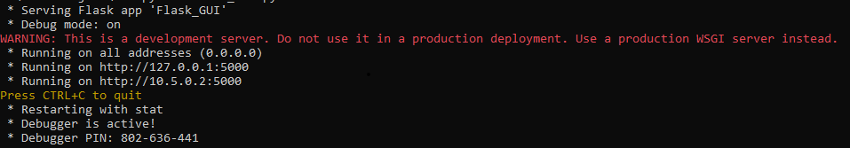

# BPMN Translator

A Flask web application that converts BPMN 2.0 XML diagrams into structured CSV files and optionally sends the output to GPT-4o for process analysis.

Built as a client project to automate manual extraction of business process data from diagram files.



## What It Does

1. **BPMN → CSV**: Parses a `.bpmn` file, extracts all flow elements (tasks, events, gateways, subprocesses), determines execution order via graph traversal, and writes a structured CSV with columns for task order, type, dependencies, outgoing flows, and responsible lane.
2. **CSV → GPT-4o**: Sends the generated CSV to the OpenAI API and saves the analysis as a `.txt` file.

## Tech Stack

- **Python 3** — `xml.etree.ElementTree` (stdlib) for XML parsing, `csv` (stdlib) for output
- **Flask** — web interface with file upload handling
- **OpenAI API** — GPT-4o for process analysis
- **Docker** — containerised deployment with auto-generated self-signed SSL

## How the Conversion Works

The converter performs a depth-first graph traversal starting from the BPMN `startEvent`:

- Sequence flows are mapped as directed edges between element IDs
- Task order is assigned incrementally as nodes are visited
- Diverging `exclusiveGateway` elements get branching sub-orders (e.g. `3.1` for loop-back paths)
- Nested `subProcess` elements get bracketed sub-orders (e.g. `4[1]`, `4[2]`)
- Lane/swimlane membership is resolved separately and joined to each task as "Responsible for Action"

## Setup

Requires [Docker Desktop](https://www.docker.com/products/docker-desktop/).

```bash
git clone https://github.com/SheriefS/BPMN-Translator-pub.git
cd BPMN-Translator-pub

# Add your OpenAI API key
echo 'OPENAI_API_KEY="your-key-here"' > src/.env

# Build and run
docker build -t bpmn-translator .
docker-compose up
```

Open [https://localhost:5000](https://localhost:5000). Accept the self-signed certificate warning.

## Usage

1. **Convert**: Upload a `.bpmn` file, specify an output filename, click Convert. The CSV is saved to `generated_csvs/`.
2. **Analyse**: Upload the generated CSV, specify an output filename, click Send to ChatGPT. The response is saved to `chatgpt_responses/`.

## Known Limitations / Future Work

- Dependency versions are unpinned in `requirements.txt`
- The GPT-4o prompt is generic — a domain-specific prompt would improve analysis quality
- No automated tests
- Could be migrated to FastAPI for async handling and auto-generated API docs
